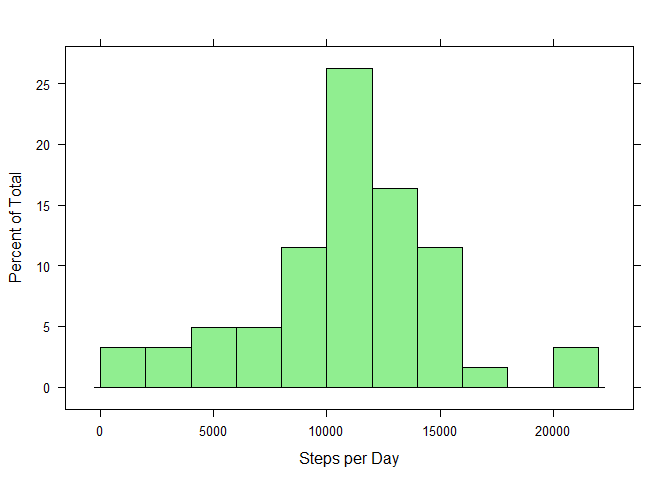
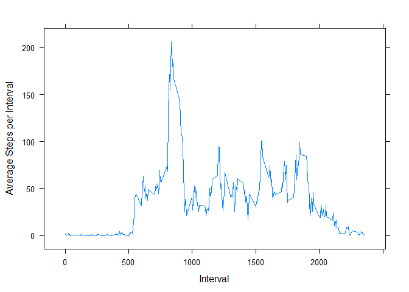
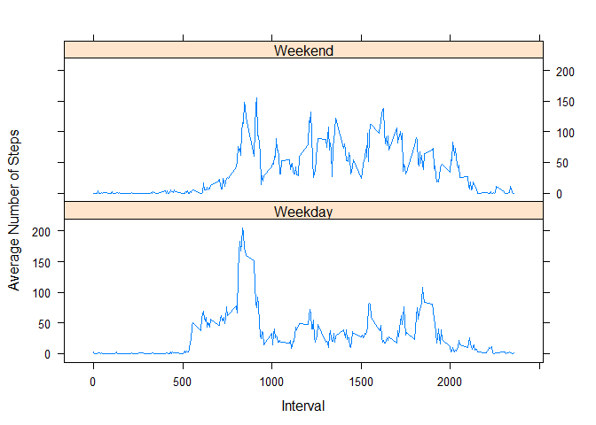

# Reproducible Research: Peer Assessment 1

This study makes use of data collected from a personal activity monitoring device. This device collects data at 5 minute intervals through out the day. The data consists of two months of data from an anonymous individual collected during the months of October and November, 2012 and includes the number of steps taken in 5 minute intervals each day.

The variables included in this dataset are:

* **steps**: Number of steps taking in a 5-minute interval (missing values are coded as NA)
* **date**: The date on which the measurement was taken in YYYY-MM-DD format
* **interval**: Identifier for the 5-minute interval in which measurement was taken

The dataset is stored in a comma-separated-value (CSV) file and includes a total of 17,568 observations.

## Loading and preprocessing the data

Decompress and load the data from the zip file, located in the current working directory:

```r
unzip('activity.zip')
activity <- read.csv('activity.csv')
```

## What is mean total number of steps taken per day?

```r
# Load required packages
library(lattice)
library(dplyr)
```

```
## 
## Attaching package: 'dplyr'
## 
## The following objects are masked from 'package:stats':
## 
##     filter, lag
## 
## The following objects are masked from 'package:base':
## 
##     intersect, setdiff, setequal, union
```

First, the *steps* data is summarized by calculating the total number of steps taken per day. A histogram plots the results.


```r
# Calculate the total number of steps for each day, ignoring missing values
stepsByDaySum <- summarize(group_by(activity, date), steps=sum(steps))
# Draw a histogram of the daily counts
histogram(stepsByDaySum$steps, breaks=10, xlab='Steps per Day', col='lightgreen')
```

 

```r
# Calculate central measures
mean(stepsByDaySum$steps, na.rm=TRUE)
```

```
## [1] 10766.19
```

```r
median(stepsByDaySum$steps, na.rm=TRUE)
```

```
## [1] 10765
```

As reported above, and confirmed by the histogram, the mean and median are quite similar when missing values are ignored:

* **Mean**:		10766
* **Median**:	10765

## What is the average daily activity pattern?

Next is an examination of the number of steps taken in each 5-minute interval, averaged across all days. The accompanying line plot illustrates the pattern.


```r
# Calculate averange number of steps per interval
stepsByIntervalAvg <- summarize(group_by(activity, interval), steps=mean(steps, na.rm=TRUE))
# Draw a line plot of the average values
xyplot(steps ~ interval, data=stepsByIntervalAvg, type='l', xlab='Interval', ylab='Average Steps per Interval')
```

 

```r
# Identify interval with the maximum average of steps
stepsByIntervalAvg[which.max(stepsByIntervalAvg$steps),]
```

```
## Source: local data frame [1 x 2]
## 
##   interval    steps
## 1      835 206.1698
```

The period of most activity is the interval between 8:35 and 8:40 in the morning. This interval coincides with the typical activities of getting organized for work (e.g., rising, having breakfast, getting to the bus or train, *et al*).

## Imputing missing values


```r
# Count number of missing step values
sum(is.na(activity$steps))
```

```
## [1] 2304
```

There are 2304 cases where the value for *steps* is missing (**NA**).

To fill in these missing values, the median number of steps in each interval was chosen as the imputation value. The median seems to appropriately represent a "likely" value, a it is less affected by extreme values than the mean. A new data set was created with the missing values assigned accordingly.


```r
# Calculate median for each interval
stepsByIntervalMed <- summarize(group_by(activity, interval), steps=median(steps, na.rm=TRUE))
# Make a copy of the original data
activityNew <- activity
# Assign each missing value the median value from its corresponding interval
for(i in 1:nrow(activityNew)) {
	if(is.na(activityNew[i,]$steps)) { 
		activityNew[i,]$steps <-
			stepsByIntervalMed[stepsByIntervalMed$interval==activityNew[i,]$interval,]$steps 
	}
}
# Calculate new total number of steps per day
stepsByDaySumNew <- summarize(group_by(activityNew, date), steps=sum(steps))
# Draw a histogram of the results
histogram(stepsByDaySumNew$steps, breaks=10, xlab='Steps per Day', col='lightgreen')
```

 

```r
# Calculate central measures (no missing values)
mean(stepsByDaySumNew$steps)
```

```
## [1] 9503.869
```

```r
median(stepsByDaySumNew$steps)
```

```
## [1] 10395
```

Again, as reported above (with missing values filled in):

* **Mean**:		9504
* **Median**:	10395

The median is similar to the previous value of 10765, illustrating its relative robustness. The mean, on the other hand, has been significantly affected by the inclusion of imputed values for the **NA**s in the original data set. As illustrated by the histogram, it has been pulled down quite a bit by the spike of small values that replaced the missing ones.

To summarize, the median was largely unaffected by the imputation of missing values, while the mean was reduced significanlty.

## Are there differences in activity patterns between weekdays and weekends?

Finally, the average number of steps per interval is broken down by a new variable which indicates whether the related activity occurred on a weekday or on the weekend. There appear to be observable differences in the patterns presented, illustrated by the panel of line plots.

* Weekend activity starts later than on weekdays, perhaps because the subject slept in a bit.
* Weekend activity is more dispersed throughout the day, as opposed to the noticable spike in the early mornings of the weekdays.


```r
# Create new variable indicating weekend/weekday
activityNew$day <- ifelse(
	weekdays(as.Date(activityNew$date)) %in% c('Saturday', 'Sunday'), 'Weekend', 'Weekday')
# Make new variable a factor
activityNew$day <- as.factor(activityNew$day)
# Calculate new average number of steps per interval
stepsByIntervalDayAvg <- summarize(group_by(activityNew, day, interval), steps=mean(steps))
# Draw a line plot of average number of steps per interval, conditioned on the weekend/weekday variable
xyplot(steps ~ interval | day, data=stepsByIntervalDayAvg, type='l', layout=c(1,2), 
	xlab='Interval', ylab='Average Number of Steps')
```

 
